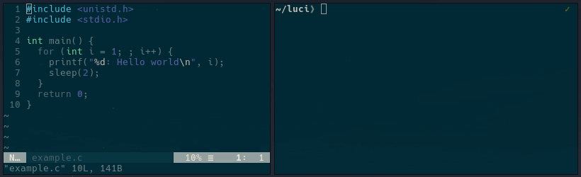

> I want to get rid of all the diseases plaguing mankind — and replace them with worse ones!

*Luci* — linker/loader daemon
=============================

*Luci* is a linker/loader daemon experiment for academic purposes with hackability (not performance!) in mind - a platform for prototypes!
Its main purpose is to demonstrate dynamic software updating on off-the-shelf binaries.

 * **Interactive Programming**:
   *Luci* can be used as a drop-in replacement for the system's default static linker (`ld`) to directly execute reloactable object files (`*.o`).
   *Luci* automatically detects changes and performs the updates during runtime.
   The relevant relocations in the old code are updated atomically to point to the latest version of the symbols.
   This allows generic [interactive/live programming](https://en.wikipedia.org/wiki/Interactive_programming) without having to prepare or adapt the source code.
 * **Shared Libraries**:
   *Luci* is able to automatically update compatible shared libraries during runtime in a process:
   If the binary is executed with the *Luci* dynamic linker/loader (e.g., as parameter or by modifying the interpreter string in the ELF file), the shared librarieson the file system are monitored.
   On a change (symbolic link or file itself) *Luci* will check if it can update the file (e.g., the writable section must be identical), load it and relink it.
   It creates a memory alias of the writable section(s) in the new version and updates entries in the *Global Offset Table*s to point to the symbols of the new version.
   However, if the update is not possible or *Luci* detects the use of outdated code, it informs the user.
 * **Whole Process**:
   By combining the previous methods, *Luci* is able to update all parts of a process, including the executable binary.
   In addition, it reconstructs stripped symbols and internal relocations, and has the ability to update certain (endless) loops by redirecting to the new version at appropriate points — thus using binary patching techniques.
   Apart from an identical wirtable section, it has no other restrictions on the binaries.

Demo
----

This screencast shows a *Hello World* example that is modified twice at runtime by simply recompiling the binary.
It was recorded on a standard Ubuntu 22.04 / Jammy, using only the default compiler & linker flags (no custom build tools, no debug symbols, no whatsoever).
The default dynamic linker/loader is changed to *Luci* (using `elfo-setinterp`) before start to load with the application and automatically detect & apply the changes by relinking the code.

Idea & Concept
--------------

Research on [dynamic software updating](https://en.wikipedia.org/wiki/Dynamic_software_updating) began four decades ago and many exciting techniques have been published so far.
However, the vast majority of these approaches require changes to the source code, compiler(-flags), or build system and, therefore, are not widely used.
Hence, *Luci* sets the hurdle of enabling generic userspace live-patching as low as possible and, thus, works purely on binary level — exactly as they are shipped nowadays from distributors.
This has the advantage of being compiler-, build-chain-, and language-agnostic, as long as it generates native binaries in the [Executable and Linkable Format (ELF)](https://en.wikipedia.org/wiki/Executable_and_Linkable_Format).

In addition, *Luci* focuses primarily on bug/security fixes, as these require rapid deployment.
Observations have shown that such fixes usually are limited to certain code changes/additions (e.g., bounds checking) and do not involve structural changes or the introduction of new global variables.
Thanks to advancements in [reproducible builds](https://reproducible-builds.org/) in recent years and common hardening techniques like relocation read-only (RELRO) it is quite likely that compilers generate identical writable sections in such cases — a necessary requirement for updates with *Luci*.

These considerations lead to the implementation of *Luci* as a dynamic linker/loader, with the ability to load new versions of a binary into the process virtual memory and relink it accordingly to the relocation information in the ELF.
The writable data sections of the old version, whose alignment, arrangement, and size must not differ from the new one, are aliased into the memory area of the updated version.
Since multiple versions of a binary can co-exist in the virtual memory, no global or local quiescence is needed for the update.

Build
-----

First make sure that you are using a `x86_64` architecture, a Linux Kernel 4.11 or newer, and a compatible distribution (e.g., Debian and Ubuntu, see below), have common build utilities (`gcc`/`g++`, `make` etc.) installed and check if all submodules are (recursively) checked out.
To do this on recent releases of Debian and Ubuntu LTS, you can run

    apt update && apt install -y build-essential file git gcc g++ libcap2-bin libc++-dev make python3 python3-pyparsing sudo
    git submodule update --init --recursive

> **Please note:** If you encounter any problems, you should consider using a fresh installation in a virtual machine or containerized environment to test this project — your system may have a configuration (e.g., `LD_PRELOAD`) that interferes with *Luci*.

If you just want to use it on your system, we strongly recommend creating the directory `/opt/luci` (and give permission to your user)

    sudo mkdir /opt/luci
    sudo chown -R $(id -u):$(id -g) /opt/luci

A subsequent

    make

will build `ld-luci-${OS_NAME}-${OS_VERSION}` for your system (as long as your distribution and version is supported; see section *Compatibility* below) and create a symlink `/opt/luci/ld-luci.so` to the RTLD.
Furthermore, this will generate a *Luci* configuration file `ld-luci.conf` (with sane default values) and a file `libpath.conf` containing library search paths (based on `/etc/ld.so.conf`).

Use

    make all

to build *Luci* for every supported distribution/version.

> **Please note:** Debian Stretch and OpenSUSE Leap 15 have by default old versions of GCC, which do not support C++20. For building Luci, use a different system (e.g. via Docker) instead. The reference system is Ubuntu Jammy (22.04).

For a full-featured experience, please install the tools provided in the [Bean](https://gitlab.cs.fau.de/luci-project/elfo) and [Elfo](https://gitlab.cs.fau.de/luci-project/elfo) submodules.
Make sure you meet the Python3 Packages requirements by using [pip](https://pypi.org/project/pip/), for Debian/Ubuntu with

    apt install -y python3-pip
    pip3 install -r bean/requirements.txt
    make -C bean
    make -C bean/elfo

### Docker

Of course you can use a container for build and testing.
After cloning this repository with all submodules, you can use the helper script [`docker.sh`](tools/docker.sh) (located in the `tools` folder) to start an development environment:

    tools/docker.sh debian:bookworm

This will fetch the `debian:bookworm` docker image, install the required build tools and create a copy of the source repository located in `/builds/luci` -- ready for you to start with `make` to build the project.

Usage
-----

**Have a look at the [`example`](example/) folder, especially the [Fibonacci demos](example/fibonacci/README.md) for a quick demonstration!**

If you want to run a custom binary `~/a.out` (with parameter `foo`) with *Luci*, you can either start the *Luci* dynamic linker/loader with the binary as argument

    /opt/luci/ld-luci.so ~/a.out -- foo

or change its interpreter to the `ld-luci.so` path, during compilation with `-Wl,--dynamic-linker=/opt/luci/ld-luci.so` or with the `elfo-setinterp` tool

    ./bean/elfo/elfo-setinterp ~/a.out /opt/luci/ld-luci.so

> **Please note:** For this tool the new path must not be longer than the previous one - since the default is usually `/lib64/ld-linux-x86-64.so.2` (27 characters), the default path to the *ld-luci.so* symlink with only 20 characters will fit.
> Otherwise, you can try [PatchELF](https://github.com/NixOS/patchelf), however, it might reorder the sections, which could lead to issues.

After you have modified the interpreter, executing

    ~/a.out foo

will run it with *Luci*.
You are able to control the behavior not only by the configuration file but also using environment variables.
To list the available settings, run

    /opt/luci/ld-luci.so -h

### Optional Inferface for Updating

While Lucis approach does not require the application to be customized for / aware of dynamic updates, it still provides an interface to control the update point or transfer data structures.

A manual update point can be specified by calling `__luci_update()`, a symbol provided by Luci.

    extern void __luci_update() __attribute__((weak));
    // ...
    if (__luci_update)
        __luci_update();

While new files are automatically detected and parsed, they are not applied to applications using this symbol until the update point is reached.
A return value of `1` indicates an update, while a call with no update pending will immediately return with a value of `0`.

To handle structural changes, it is possible to serialize and deserialize the data between versions using

    void * __luci_serialize(int);
	void __luci_deserialize(void*);

If present, the serialize function is called in the old version just before an update.
Its parameter is set to `1` if the corresponding object is due to be updated (accordingly, each object can have its own set of serialization mechanisms).
The return value is passed to the deserialization function in the updated version, which is called immediately after the update.
Accordingly, this value should contain a pointer to the payload data in heap-allocated memory in a compatible format.

The manual update points and the serialization are independent of each other.

### Debug Symbols

While debug symbols are not required for the update, they can contribute to the compatibility detection.
In case you have binaries with external debug symbols (either local or using [debuginfod](https://sourceware.org/elfutils/Debuginfod.html) to retrieve them), the service `bean-elfvarsd` can process them for *Luci* and respond with the resulting hash using a (tcp/unix) socket.

    bean/tools/elfvarsd.sh -c '.test-cache' 0.0.0.0:9001 /path/to/debug-dir

    export LD_DEBUG_HASH=tcp:127.0.0.1:9001

> **Please note:** Appendix E of the [DWARF4 Standard](https://dwarfstd.org/doc/DWARF4.pdf) defines compression and duplicate elimination mechanism.
> These techniques, e.g. provided by [dwz](https://sourceware.org/dwz/) and used to reduce the size of debug packages in *Ubuntu Jammy* and *Debian Bullseye*, are not supported yet by the tools.

Test cases
----------

*Luci* has several test cases to automatically test glibc compatibility and update functionality.
They are located in the [`test` directory`](test/README.md).

On each push to the *Luci* main repository, the [project's GitLab CI](https://gitlab.cs.fau.de/luci-project/luci/-/pipelines/) will run all default test cases on every supported distribution (using GCC and LLVM), plus the language test cases on all supported Debian and Ubuntu versions.
For this reason, we provide [Docker images](https://gitlab.cs.fau.de/luci-project/docker) on [Docker Hub](https://hub.docker.com/r/inf4/luci/tags) on which the required tools are already installed.
You can use it for testing instead (and save time and bandwidth on subsequent runs):

    ./tools/docker.sh inf4/luci:almalinux-9 ./test/run.sh -u "2-.*"

Compatibility
-------------

*Luci* aims to be compatible to the [GNU C Library (glibc)](https://www.gnu.org/software/libc/) in major desktop/server Linux distributions, so it is able to handle its binaries.

In those distributions, glibc provides the system's default dynamic linker/loader (aka *run-time link-editor* (RTLD) aka `ld.so`/`ld-linux.so`).
Because of this origin, RTLD and the actual libc shared library (`libc6.so` etc.) are closely intertwined - sharing data structures and sometimes even inlining functions of each other.
Furthermore, distributions not only tend to use different configurations but often backport several patches/features from newer versions.

Hence, *Luci* must be tailored to each distribution and version, providing the required data structures and intercepting certain inlined functions from the libc (mainly methods used to dynamically load objects, e.g., `__libc_dlopen_mode`).

> **Please note:** Since newer glibc versions are distributed without symbol table, *Luci* uses the script `tools/patch_offsets.sh` to retrieve the offsets of the corresponding symbols from the debug binaries (downloading them via [debuginfod](https://sourceware.org/elfutils/Debuginfod.html) in case they are not available locally) automatically during build for convenience.
> Hence, *Luci* has to be updated/recompiled if the local glibc version changes.

Since the two main debianoid distributions (Debian and Ubuntu) have an excellent archive of previously released packages (and are a great target for backtesting), these are well-tested in *Luci*.
However, *Luci* supports additional distributions as well - with the ability to at least successfully run the [default test suite](test/default).

 * [Debian](https://www.debian.org/)
    * 9 / Stretch (with glibc 2.24) - released June 2017, end of life (LTS) since June 2022
    * 10 / Buster (with glibc 2.31) - released July 2019
    * 11 / Bullseye (with glibc 2.31) - released August 2021
    * 12 / Bookworm (with glibc 2.36) - released June 2023
 * [Ubuntu](https://ubuntu.com/) LTS
    * 20.04 / Focal Fossa (with glibc 2.31) - released April 2020
    * 22.04 / Jammy Jellyfish (with glibc 2.35) - released April 2022
 * [AlmaLinux](https://almalinux.org/), [Oracle Linux](https://www.oracle.com/linux/) & [Red Hat Enterprise Linux](https://www.redhat.com/de/technologies/linux-platforms/enterprise-linux)
    * Version 9 (with glibc 2.28) - released May / June 2022
 * [Fedora](https://fedoraproject.org/)
    * Version 36 (with glibc 2.35)
    * Version 37 (with glibc 2.36)
 * [openSUSE Leap](https://get.opensuse.org/leap)
    * Version 15 (with glibc 2.31)

At the moment, *Luci* is limited to the `x86_64` architecture.

> **Please note:** Only a subset of glibc functionality is supported.

To be able to detect access to outdated code, Linux Kernel 4.11 or newer is required (for certain `userfaultfd` features).
In addition, [userfaultfd](https://docs.kernel.org/admin-guide/mm/userfaultfd.html) must be enabled for *Luci*.
To do so, either assigning the *Luci* binary the required capability by executing

    sudo setcap cap_sys_ptrace=eip $(readlink -f /opt/luci/ld-luci.so)

or globally enable unprivileged usage:

    echo 1 | sudo tee /proc/sys/vm/unprivileged_userfaultfd

Dependencies
------------

 * [Dirty Little Helper](https://gitlab.cs.fau.de/luci-project/dlh) provides the required standard library functions as well as the data structures (tree/hash set/map) for creating static freestanding applications (without glibc).
   * The standard libraries (neither libc nor libstdc++) are not used, as we need to take care of bootstrapping -- providing several caveats; just think of `errno` in conjunction with thread local storage (TLS)!
     A static libc build is not an option either, as it would contain its own TLS setup (which would interfere with our dynamic loading).
   * For Linux, all required system call wrapper are embedded in this library.
 * [Elfo](https://gitlab.cs.fau.de/luci-project/elfo) is a lightweight parser for the Executable and Linking Format, supporting common GNU/Linux extensions
 * [Bean](https://gitlab.cs.fau.de/luci-project/elfo), the binary explorer/analyzer, is employed to compare binary files (shared libraries) and detect changes to decide if an update is safely possible.
   * Bean itself uses the [Capstone Engine](http://www.capstone-engine.org/)

Author & License
----------------

The *Luci* project is being developed by [Bernhard Heinloth](https://sys.cs.fau.de/person/heinloth) of the [Department of Computer Science 4](https://sys.cs.fau.de/) at [Friedrich-Alexander-Universität Erlangen-Nürnberg](https://www.fau.eu/) and is available under the [GNU Affero General Public License, Version 3 (AGPL v3)](LICENSE.md).
