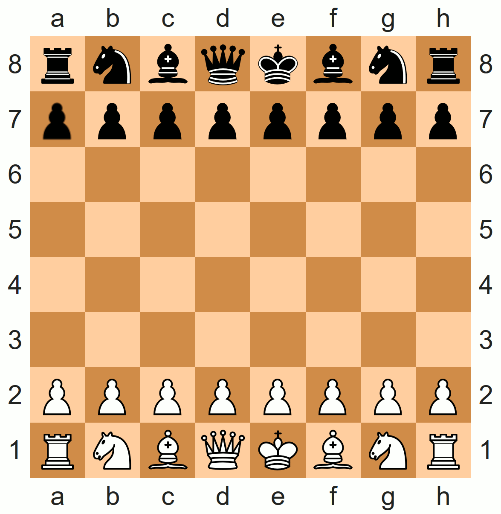

Luci Chess Interactive Programming
==================================

This example is based on [chessba.sh](https://github.com/thelazt/chessbash) and [SPiChess](https://gitlab.cs.fau.de/i4/spic/chess).




Prerequisites
-------------

  * [X Window System](https://en.wikipedia.org/wiki/X_Window_System) and [SDL](https://www.libsdl.org/) libraries
  * Terminal emulator with support for color and Unicode characters - [GNOME Terminal](https://wiki.gnome.org/Apps/Terminal) is recommended


Setup
-----

  * Configure SDL to use the X driver by setting an environment variable
    ```
    SDL_VIDEODRIVER=x11
    export SDL_VIDEODRIVER
    ```
  * Create a (named) pipe to display *standard error* in a separate terminal window
    ```
    mkfifo err.pipe
    ```
  * Start new terminal window, change to the example directory, and listen to the pipe
    ```
    cat err.pipe
    ```
  * Copy the base version, compile and run it with *Luci*
    (with parameter `-s` for static linking, `-u` for dynamic updates and, optionally, `-v 3` for increased verbosity)
    ```
    cp base/* .
    make ai.o board.o game.o openings.o tui.o
    /opt/luci/ld-luci.so -v 3 -s -u ai.o board.o game.o openings.o tui.o 2> err.pipe
    ```
    This will start an interactive game, player 2 is controlled by the user, using algebraic notation for the move.
    Alternatively, `autoplay.sh` can be used to enter dummy moves:
    ```
    ./autoplay.sh | /opt/luci/ld-luci.so -v 3 -s -u ai.o board.o game.o openings.o tui.o 2> err.pipe
    ```
  * Finally, open a new terminal window and change to the example directory, make the changes (or apply the patches) and compile the changed files:
    ```
    patch -p1 < v1.patch
    make game.o
    ```

➜ to have these steps performed automatically, run `demo.sh`.


Run
---

Below is a sequence of possible changes to the code in the `base' directory, each step demonstrating a different feature of *Luci*.
For each change described, there is also a corresponding patch file.


### Base version

The base version consists of five modules:

  * `board`: playing field and chess of rules
  * `ai`: [Negamax](https://en.wikipedia.org/wiki/Negamax) (compact variant of [Minimax](https://en.wikipedia.org/wiki/Minimax)) with [α-β-pruning](https://en.wikipedia.org/wiki/Alpha%E2%80%93beta_pruning) and evaluation functions
  * `openings`: (minimalist) opening database
  * `tui`: terminal user interface
  * `game`: manages moves

When the game is started after compilation, the first player is controlled by the AI and the second by the user.
To control the move, first enter the field with the piece you want to move, then the destination field.
The output consists of a simplified [algebraic notation](https://en.wikipedia.org/wiki/Algebraic_notation_(chess)), with each move in a new line.


### Revision 1: Code change

The output is changed, for example to print the round number and then the moves of both players in one line (which is more like the common algebraic notation used in chess books).
Therefore, the call to `fputc` in the function `game_describe` (file `game.c`) is replaced.
The first player's move is outputed on a new line before the actual move is printed, while the second player's move is preceded by a space:
```
// Show round linewise
if (player < 0)
	fprintf(out, "\n%3d. ", board_moveCounter() / 2 + 1);
else
	fputc('\t', out);
```
After the change, `make game.o` will compile the output (but of course you can also invoke the compiler directly with `gcc -c game.c`).
*Luci* will detect the change and update the game.

Unless you are using `autoplay.sh`, you will have to finish your move before you will see the effect of the changed code -- since the old code may be executed currently and therefore is still on the call stack.


### Revision 2: Changing constants / read-only variables

Now it is time to let the AI play against itself.
Therefore the second value of the array `game_playerStrength` (again in `game.c`) is changed, for example from `0` (for user) to `4` (which is the recursion level of *negamax* and therefore the strength of the AI).

Compile, finish your turn, and from now on you don't need to manually move a piece again.
Unless you revert this change.
Or even make this to [PvP](https://en.wikipedia.org/wiki/Player_versus_player) by changing both values to `0`.


### Revision 3: New variable

In this step, a chess clock is added to the game, which measures the time each player takes to make his move.
So we need to introduce a new variable and extend the code to measure the time.
For the implementation, `gettimeofday` can be used (which also shows that [vDSO](https://en.wikipedia.org/wiki/VDSO) works).

Compile it, and from now on the moves of each user will be measured.
If you use the AI for both players at the same level, it's quite possible that the calculations will take a similar amount of time and you won't see any difference between them when displaying the time in low resolution.

Feel free to remove the feature (and build) and then reintroduce it -- you will see that removing and the adding again will reset the counter.
But for other changes, the counter will continue to increment.
This is an intentional behavior.

For better testing, [v3 patch](`v3.patch`) has the preprocessor macro `CHESS_CLOCK` to control whether the clock should be included or not.


### Revision 4: New function

Let's work on a better output.
First choice is a simple ASCII art board, implemented in a new function `tui_draw` (therefore located in `tui.c`).
The new function has to be called at every `game_step`, while the algebraic notation should not be printed to standard output -- so it is moved to standard error.
The [v4 patch](`v4.patch`) contains a compact implementation.

Compile `tui.c` first, then `game.c`.


### Revision 5: Missing symbols

This is kinda similar to the previous one, but uses an improved colored board with [Unicode pieces](https://en.wikipedia.org/wiki/Chess_symbols_in_Unicode).
And to support moves, the board highlights possible moves when a piece is selected.
This requires additional variables and some new functions.

However, this time the `game.c` will be compiled first -- it will now reference the new functions from `tui.c` which have not been compiled yet.
*Luci* will detect the change in `game.o`, analyze the file, but reject the update because of the missing files.
Therefore, you have to compile `tui.c` and then recompile `game.c` to make the changes take effect.


### Revision 6a: Dynamic library

At startup, the standard C library (libc) was loaded implicitly (due to an implicit `-lc` parameter).
But now a new library should be loaded dynamically:
`libSDL_image.so` via `dlopen` in an existing, frequently called function.

Compile it - and wait a while:
This library has several dependencies, which in turn have dependencies.
Since dynamic updates of shared libraries are enabled, all files will be parsed and this can take several seconds.


### Revision 6b: Using the new dynamic library

First, remove the code that loads the dynamic library -- it is no longer needed, the library is now loaded in the process.
It is now equivalent to *Luci* started with `-lSDL_image`.
Lets use SDL to draw a graphical chessboard, using the images from the corresponding folder.

Compile, and you should see a nice chessboard.


Limitations
-----------
 * no customizations in `main` possible (they will be ignored)
 * customizations in the game loop will only take effect in the next round
 * Visibility: no `static` functions, otherwise the compiler already does the linking.
